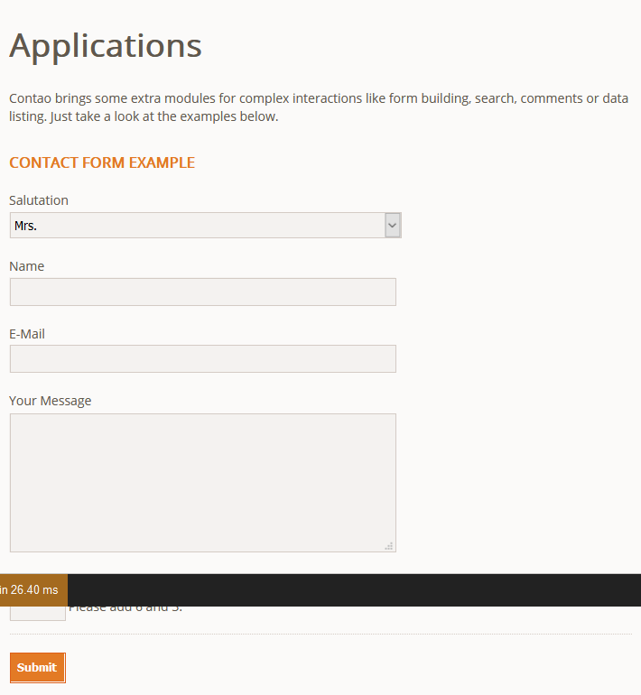
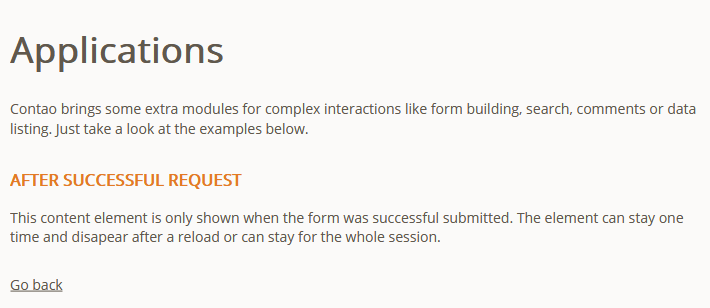
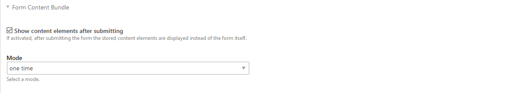
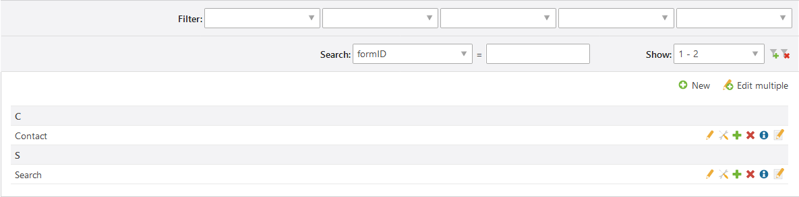

[](https://packagist.org/packages/tastaturberuf/contao-form-content-bundle)
[](https://contao.org)
[](https://github.com/Tastaturberuf/contao-form-content-bundle)
[](https://github.com/Tastaturberuf/contao-form-content-bundle/commits/master)

# Contao Form Content Bundle

With this Contao bundle you can easily show various content elements instead of the form itself after successful submitting it.
**Now you don't have to build an entire redirect page to thank your customer or leave additional notes.**

## Frontend



*This is the example form*


 
 *After the submit we display a simple text content element.*

## Backend


To activate this feature you can use the checkbox in the form configuration. 


 
 *The backend setting in the form configuration.*



*The new Operation to add content elements to forms.*

## Install

### via Composer
```
composer require tastaturberuf/contao-form-content-bundle
```
### via Contao Manager
search for `tastaturberuf/contao-form-content-bundle`

➡ [Link to the Contao Extension Repository](https://extensions.contao.org/?p=tastaturberuf%2Fcontao-form-content-bundle)


## Translations

- [ ] Chinese - 中文(简体)
- [ ] Czech - Čeština
- [ ] Dutch - Nederlands
- [x] English - English
- [ ] French - Français
- [x] German - Deutsch
- [ ] Italian - Italiano
- [ ] Japanese - 日本語
- [ ] Latvian - Latviešu
- [ ] Persian - فارسی
- [ ] Polish - Polski
- [ ] Portuguese - Português
- [ ] Russian - Русский
- [ ] Serbian - Српски
- [ ] Spanish - Español

## Maintainer
[Tastaturberuf](https://tastaturberuf.de) **with ♥ and Contao**
